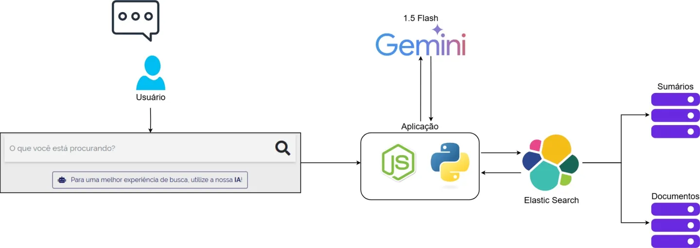

# Academ.ia

**Academ.ia** é um projeto de Recuperação de Informação  com foco em Inteligência Artificial Generativa (RAG). Este sistema é composto por várias partes que se complementam para entregar uma solução robusta e integrada.

Abaixo está a arquitetura geral do projeto:



## Estrutura do Projeto

O projeto está organizado em quatro diretórios principais:

1. **`rag_frontend`** - Interface de usuário do chatbot desenvolvida em React.
2. **`rag_backend`** - Backend desenvolvido em Flask para gerenciar as funcionalidades da API.
3. **`ingestion_module`** - Módulo para extração de dados da web, particionamento em chunks e indexação no Elasticsearch.
4. **`capes_site`** - Protótipo de interface do site da Capes para exemplificar melhorias de UX.

---

## Configuração e Inicialização

### 1. **Frontend: `rag_frontend`**
#### Passos:
- Navegue até a pasta `rag_frontend`:
  ```b
  cd rag_frontend
  ```
- Instale as dependências:
  ```
  npm install
  ```
- Inicie o servidor do frontend:
  ```
  npm start
  ```

#### Requisitos:
- **Node.js** versão 14 ou superior.

---

### 2. **Backend: `rag_backend`**
#### Passos:
- Navegue até a pasta `rag_backend`:
  ```
  cd rag_backend
  ```
- Crie e ative um ambiente virtual:
  ```
  python -m venv venv
  venv\Scripts\activate
  ```
- Instale as dependências:
  ```
  pip install -r requirements.txt
  ```
- Configure um arquivo `.env` na pasta `rag_backend` com os seguintes dados:
  ```
  GEMINI_API_KEY=seu_token_gemini
  ELASTICSEARCH_API_KEY=sua_api_key
  ELASTICSEARCH_HOST=seu_host (http://localhost:9200, caso seja local)
  ```
- Inicie o servidor do backend:
  ```
  python app.py
  ```

#### Requisitos:
- **Python** versão 3.8 ou superior.
- Elasticsearch em execução na máquina.

---

### 3. **Módulo de Ingestão: `ingestion_module`**

#### Passos:
- Antes de rodar o código de ingestão, é necessário subir uma instância do elasticsearch, caso deseja utilizar de forma gratuita, suba de forma local, segue referência para instalação:
     
    <a href="https://www.youtube.com/watch?v=A0z3acG9ncE&t=531s" target="_blank">
      
    </a>


- Navegue até a pasta `ingestion_module`:
  ```
  cd ingestion_module
  ```
- Execute o script para ingestão de dados:
  ```
  python ingest_elastic.py
  ```

#### Funcionalidades:
- Extração de dados da web.
- Divisão de textos em chunks.
- Indexação no Elasticsearch:
  - **`summary_index`**: Dados resumidos.
  - **`full_doc_index`**: Documentos completos.

---

### 4. **Protótipo de Interface: `capes_site`**
- Navegue até a pasta `capes_site` e abra o arquivo `index.html` em um navegador para visualizar o protótipo.

---

## Estrutura de Diretórios

```
academ.ia/
│
├── rag_frontend/         # Interface do usuário (React)
├── rag_backend/          # Backend (Flask)
├── ingestion_module/     # Ingestão e indexação de dados
├── capes_site/           # Protótipo de interface para a Capes
│
├── README.md             # Documentação do projeto
└── .gitignore            # Arquivos e pastas ignorados pelo Git
```

---

## Licença

Este projeto está licenciado sob a [MIT License](LICENSE). 
